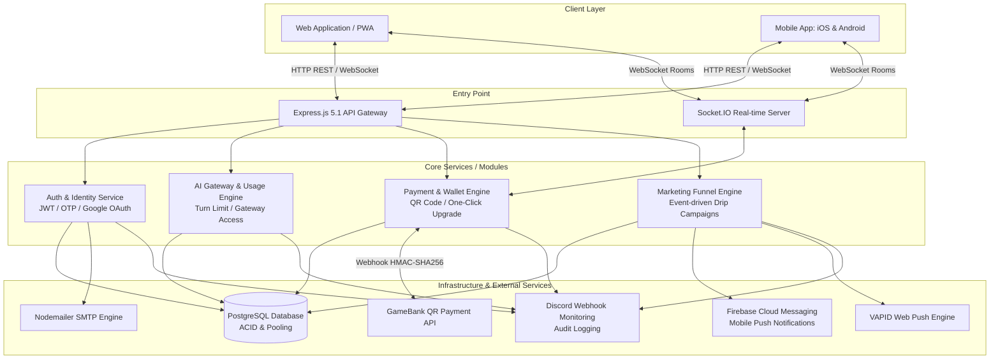
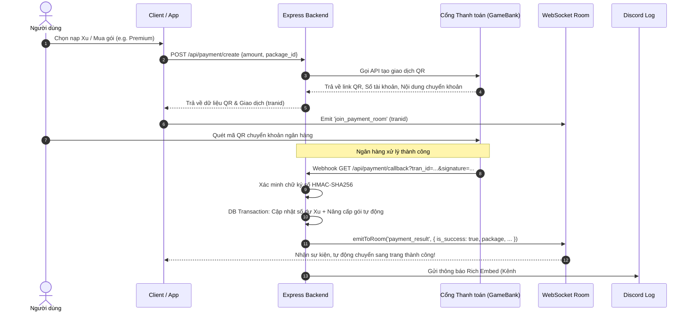
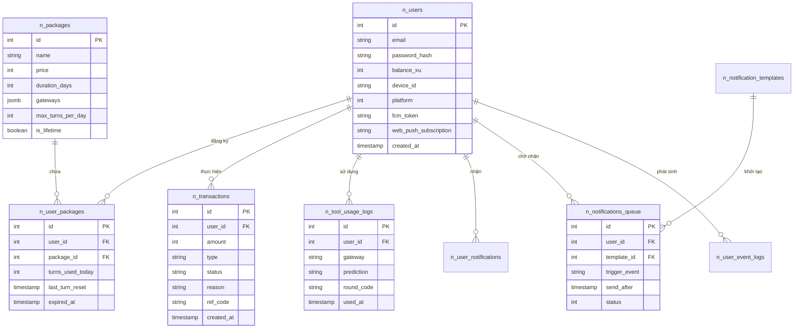

# 🚀 TOOL AI & GATEWAY PLATFORM: HỆ THỐNG DỰ ĐOÁN AI & TỰ ĐỘNG HÓA TIẾP THỊ ĐA KÊNH

> [!IMPORTANT]
> **Định vị sản phẩm**: Đây là một nền tảng Backend hiệu năng cao (High-concurrency SaaS Backend) phục vụ các hệ sinh thái giải trí trực tuyến. Hệ thống kết hợp lõi dự đoán thuật toán AI, cổng thanh toán tự động bằng mã QR, quản lý ví tiền điện tử (Xu), quản lý gói đăng ký theo cấp độ (Tier-based Subscription), và động cơ tự động hóa phễu thông báo tiếp thị đa kênh (Automated Event-driven Marketing Funnel Engine).

---

## 🌟 1. TỔNG QUAN KIẾN TRÚC HỆ THỐNG (SYSTEM ARCHITECTURE)

Hệ thống được thiết kế theo mô hình **Modular Monolith** hướng tới khả năng dễ dàng tách nhỏ thành Microservices khi quy mô mở rộng. Nền tảng được tối ưu hóa để xử lý hàng ngàn kết nối thời gian thực đồng thời, đảm bảo tính toàn vẹn dữ liệu tài chính và duy trì liên lạc đa kênh thông minh với người dùng.



---

## 🛠️ 2. CÁC CÔNG NGHỆ SỬ DỤNG (TECH STACK)

| Công nghệ | Vai trò trong hệ thống | Lý do lựa chọn & Tối ưu hóa |
| :--- | :--- | :--- |
| **Node.js & Express.js 5.1** | Lõi xử lý Backend REST API & Middleware | Phiên bản Express 5.1 mang lại khả năng tự động bắt lỗi Asynchronous (Promise rejection) ưu việt, cấu trúc mã nguồn bất đồng bộ tinh gọn. |
| **PostgreSQL (pg)** | Cơ sở dữ liệu quan hệ (RDBMS) | Bảo đảm toàn vẹn giao dịch tài chính (ACID) qua cơ chế `BEGIN/COMMIT/ROLLBACK`. Sử dụng `SELECT ... FOR UPDATE SKIP LOCKED` cho hàng đợi thông báo phân tán. |
| **Socket.IO (v4)** | Máy chủ truyền thông thời gian thực | Quản lý WebSocket theo các Room động (mapping theo ID giao dịch) để phản hồi lập tức khi thanh toán thành công mà không cần client polling. |
| **Firebase Admin & Web-Push** | Hệ thống thông báo đa nền tảng | Hỗ trợ đẩy thông báo (Push Notification) độc lập cho cả ứng dụng di động (FCM token) và trình duyệt web (VAPID subscription). |
| **Node-Cron** | Động cơ lập lịch ngầm (Background Schedulers) | Chạy các tiến trình quét sự kiện, dọn dẹp hàng đợi và tự động tính toán cấp độ người dùng với chu kỳ tính bằng phút/giờ. |
| **Discord Webhooks** | Hệ thống giám sát & Cảnh báo thời gian thực | Phân chia log thành 3 kênh riêng biệt (`#error`, `#payment`, `#upgrade`) với định dạng Rich Embed sang trọng giúp đội ngũ vận hành theo dõi 24/7. |

---

## 💎 3. CHI TIẾT CÁC PHÂN HỆ CỐT LÕI (CORE MODULES)

### 3.1 Phân hệ Xác thực & Định danh Bảo mật (Auth & Identity)
- **Đa phương thức đăng nhập**: Hỗ trợ đăng nhập truyền thống (Email/Password với mã hóa `bcrypt`) và Google OAuth2 (hỗ trợ xác thực độc lập cho cả Web và Mobile App).
- **Xác thực 2 lớp qua Email OTP**: Hệ thống tích hợp Nodemailer kết hợp engine template HTML `Mustache` để gửi mã xác thực OTP (đăng ký, khôi phục mật khẩu) với hiệu lực chính xác 10 phút.
- **Ràng buộc thiết bị độc quyền (`device_id`)**: Ngăn chặn tài khoản chia sẻ trái phép bằng cách gắn thẻ định danh thiết bị duy nhất. Bất kỳ nỗ lực đăng nhập nào từ thiết bị lạ sẽ bị từ chối nếu không được xác thực đổi thiết bị.

### 3.2 Phân hệ Quản lý Gói & AI Gateway (Subscription & Tool Execution)
- **Kiểm soát phân quyền theo Gói (Tier-based Access Control)**: Người dùng đăng ký các gói dịch vụ (`Trial`, `Trial Pro`, `Premium`, `Premium Pro`). Hệ thống tự động đối chiếu danh sách các cổng game (Gateways) được phép truy cập theo từng gói.
- **Động cơ Quota Lượt chơi Tự động**: Mỗi gói quy định số lượt sử dụng AI tối đa mỗi ngày. Middleware `checkToolUsageLimit` tự động đối chiếu ngày hiện tại (`last_turn_reset`) để làm mới (reset) lượt chơi lúc 00:00:00 mà không cần chạy job nặng nề quét toàn bộ DB.

### 3.3 Phân hệ Thanh toán QR & Ví Xu (Payment & Wallet Engine)
- **Tạo mã QR Động**: Tích hợp trực tiếp với hệ thống ngân hàng ảo thông qua GameBank API, tự động sinh mã QR với số tiền và lời nhắn duy nhất mang mã định danh giao dịch (`tranid`).
- **Bảo mật Webhook bằng Chữ ký Số (HMAC-SHA256)**: Endpoint nhận thông báo chuyển khoản từ ngân hàng xác minh tính hợp lệ của giao dịch thông qua mã băm SHA256 tổng hợp dữ liệu `username + password + amount + tran_id + errorcode + messages`.
- **Luồng "One-Click Upgrade" & Bonus**: Người dùng có thể chọn nâng cấp gói trực tiếp khi tạo mã nạp tiền. Khi thanh toán thành công, hệ thống tự động:
  1. Cộng Xu vào ví người dùng.
  2. Tính toán tiền thưởng Bonus (Ví dụ: Tặng 500.000 Xu khi nạp mốc 2.000.000 Xu).
  3. Trừ Xu và kích hoạt ngay lập tức gói đăng ký mới (tính toán chính xác thời hạn sử dụng hoặc Lifetime).



---

### 3.4 Động cơ Phễu Thông báo Tự động (Automated Marketing Funnel Engine)

> [!TIP]
> Đây là một trong những thành tựu kiến trúc sáng giá nhất của hệ thống, thể hiện tư duy thiết kế chuỗi tự động hóa (Marketing Automation) không thua kém các nền tảng SaaS quy mô lớn.

```mermaid
graph LR
    subgraph Sự kiện Kích hoạt (User Events)
        E1[ON_SIGNUP] --> E2[ON_SIGNUP_TRIAL_USED]
        E2 --> E3[ON_UPGRADE_TRIAL_PRO]
        E3 --> E4[ON_UPGRADE_PREMIUM]
        E4 --> E5[ON_PREMIUM_PRO_INACTIVE]
    end

    subgraph Xử lý của Động cơ Phễu (Engine Sweep & Schedulers)
        Sweep[Cron: Quét sự kiện mới mỗi 3 phút]
        Cancel[Hủy toàn bộ thông báo chờ của mốc cũ]
        Queue[(n_notifications_queue)]
    end

    subgraph Bộ phát Drip Campaign (Worker Dispatcher)
        Worker[Cron: Quét mỗi phút\nSELECT ... FOR UPDATE SKIP LOCKED]
        SocketNoti[Gửi qua WebSocket khi Online]
        FCMPush[FCM Push cho Mobile App]
        WebPushEngine[Web Push cho PWA/Browser]
        DBSync[Lưu lịch sử vào n_user_notifications]
    end

    E1 --> Sweep
    E2 --> Sweep
    E3 --> Sweep
    E4 --> Sweep
    E5 --> Sweep

    Sweep --> Cancel
    Cancel --> Queue
    Queue --> Worker

    Worker --> SocketNoti
    Worker --> FCMPush
    Worker --> WebPushEngine
    Worker --> DBSy​​nc
```

1. **Thu thập Sự kiện (Event Harvesting)**: Bất cứ khi nào người dùng có thay đổi về hành vi (đăng ký mới, dùng hết lượt thử, nâng cấp gói), hệ thống ghi nhận vào bảng `n_user_event_logs`.
2. **Hệ thống Lập lịch Chuỗi (Drip Campaign Scheduler)**: Tiến trình chạy ngầm quét các sự kiện mới, ánh xạ với bảng mẫu thông báo (`n_notification_templates`) và tự động lên lịch hàng loạt thông báo vào tương lai theo các mốc thời gian (Sau 0h, 6h, 12h, 24h, 48h, 72h...).
3. **Thuật toán Hủy Phễu Cũ (Funnel Cancellation Logic)**: Khi người dùng chuyển đổi thành công (Ví dụ từ `ON_SIGNUP` sang `ON_UPGRADE_PREMIUM`), hệ thống tự động quét và xóa bỏ toàn bộ các thông báo hối thúc đăng ký cũ chưa gửi trong hàng đợi, tránh việc spam gây khó chịu cho người dùng.
4. **Hàng đợi Phân tán Chịu tải Cao (Concurrency Queue Worker)**: Tiến trình Dispatcher sử dụng cú pháp SQL đặc thù:
   ```sql
   SELECT ... FROM n_notifications_queue FOR UPDATE SKIP LOCKED
   ```
   Cơ chế này khóa các bản ghi đang xử lý trong RAM, cho phép nhiều instance máy chủ cùng chạy đồng thời mà tuyệt đối không bao giờ gửi trùng lặp thông báo cho một người dùng.
5. **Giao tiếp Đa kênh & Đồng bộ Trạng thái**: Thông báo được ưu tiên gửi qua Socket nếu người dùng đang mở app; đồng thời đẩy qua Firebase (iOS/Android) hoặc Web-Push (PWA) nếu người dùng đang offline. Đồng thời, mọi bản ghi được lưu trữ định danh kèm thuộc tính `is_read` để ứng dụng đồng bộ hóa chính xác.

---

## 🗄️ 4. SƠ ĐỒ THIẾT KẾ CƠ SỞ DỮ LIỆU (DATABASE SCHEMA ERD)



---

## 🎯 5. ĐIỂM NHẤN KỸ THUẬT & GIÁ TRỊ CHỨNG MINH VỚI NHÀ TUYỂN DỤNG (KEY RESUME VALUE)

Khi trình bày dự án này với nhà tuyển dụng hoặc kiến trúc sư trưởng (Chief Architect), hệ thống chứng minh những năng lực cốt lõi sau:

### 🚀 1. Khả năng Xử lý Đồng thời & Phân tán (Distributed Concurrency Handling)
- Giải quyết thành công bài toán "Race Condition" trong các hệ thống xử lý hàng đợi bằng kỹ thuật `FOR UPDATE SKIP LOCKED` trên PostgreSQL, đảm bảo khả năng mở rộng ngang (Horizontal Scaling) mượt mà khi chạy nhiều Pod/Instance.
- Thiết kế mô hình tính toán Quota và Reset lượt sử dụng theo nguyên lý Lazy Evaluation (chỉ cập nhật khi user tương tác thay vì chạy batch job khóa bảng lúc nửa đêm).

### 🔒 2. Toàn vẹn Dữ liệu Tài chính & Bảo mật (Financial Security & ACID Compliance)
- Mọi thao tác nạp tiền, trừ tiền, chuyển đổi gói dịch vụ đều được gói chặt trong các luồng giao dịch `BEGIN/COMMIT/ROLLBACK` của PostgreSQL.
- Bảo mật tuyệt đối luồng Webhook thanh toán qua thuật toán mã băm HMAC-SHA256, vô hiệu hóa hoàn toàn rủi ro tấn công giả mạo yêu cầu thanh toán (Man-in-the-Middle / Payload Tampering).

### ⚡ 3. Trải nghiệm Người dùng Thời gian thực (Real-time UX & Smart Fallback)
- Thay vì để frontend gọi API liên tục (Polling) kiểm tra trạng thái thanh toán gây lãng phí tài nguyên máy chủ, hệ thống sử dụng WebSocket Event-driven để đẩy thông báo thành công về ngay thời điểm ngân hàng ghi nhận.
- Cơ chế Fallback đa tầng thông minh: Khi phát hiện WebSocket mất kết nối, hệ thống tự động điều hướng thông báo sang hạ tầng Firebase FCM (Mobile) hoặc VAPID Web-Push (Desktop/PWA).

### 🧩 4. Cấu trúc Mã nguồn Sạch & Dễ Bảo trì (Maintainability & Clean Architecture)
- Phân tách vai trò rõ ràng giữa các Middleware kiểm tra quyền (`checkToolUsageLimit`, `authMiddleware`), Controller xử lý nghiệp vụ, và Scheduler chạy độc lập.
- Giám sát hệ thống chủ động thông qua Discord Webhooks phân loại theo cấp độ, giúp theo dõi và phát hiện sự cố hệ thống ngay lập tức mà không cần truy cập trực tiếp vào máy chủ sản xuất.

---
*Tài liệu được xây dựng chuẩn mực nhằm phục vụ công tác đánh giá chuyên môn kỹ thuật và trình bày giải pháp kiến trúc phần mềm.*
